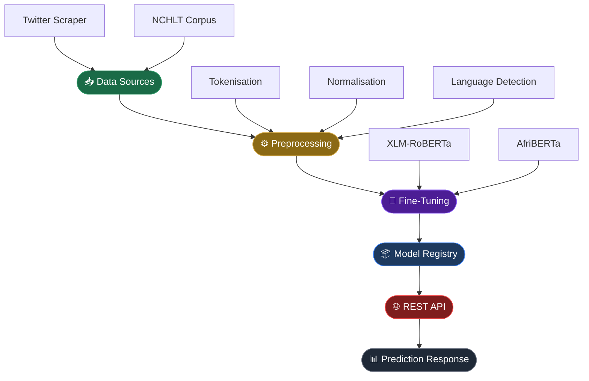
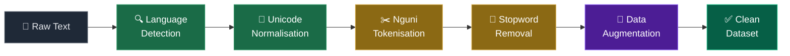

<div align="center">

<!-- ANIMATED HEADER BANNER -->


<!-- BADGES -->
[](https://python.org)
[](https://pytorch.org)
[](https://huggingface.co)
[](https://fastapi.tiangolo.com)
[](LICENSE)

[](.)
[](.)
[](CONTRIBUTING.md)
[](.)

<br/>

> **🌍 Bridging the NLP gap for 12 million+ isiXhosa and isiZulu speakers across Southern Africa.**

<br/>

</div>

---

## 📖 Table of Contents

<details open>
<summary>Click to expand</summary>

- [🌟 Overview](#-overview)
- [⚡ Quick Start](#-quick-start)
- [🏗 Architecture](#-architecture)
- [🔄 Preprocessing Pipeline](#-preprocessing-pipeline)
- [🤖 Models](#-models)
- [🌐 REST API](#-rest-api)
- [📊 Performance](#-performance)
- [🗂 Project Structure](#-project-structure)
- [💡 Why This Matters](#-why-this-matters)
- [🤝 Contributing](#-contributing)
- [📜 License](#-license)

</details>

---

## 🌟 Overview

This project builds a **state-of-the-art sentiment analysis system** for South African Nguni languages using modern transformer architectures. It is one of the few open-source NLP pipelines specifically designed and optimised for **isiXhosa** and **isiZulu**.

<div align="center">

| Feature | Details |
|:---|:---|
| 🗣 **Languages** | isiXhosa · isiZulu |
| 🧠 **Models** | XLM-RoBERTa · AfriBERTa |
| 📦 **Data Sources** | Twitter API · NCHLT Corpus |
| 🚀 **Inference** | REST API (FastAPI) |
| 🧪 **Testing** | Pytest unit + integration tests |
| ⚙️ **Config** | YAML-based configuration management |

</div>

---

## ⚡ Quick Start

```bash
# 1. Clone the repository
git clone https://github.com/your-org/african-nlp.git
cd african-nlp

# 2. Install dependencies
pip install -r requirements.txt

# 3. Place your CSV files in data/raw/ (columns: text, label)
#    then run the preprocessing pipeline
python -c "
from src.preprocess import prepare_datasets
from src.utils import load_config
prepare_datasets(load_config())
"

# 4. Fine-tune the model
python src/train.py

# 5. Launch the REST API
python api/app.py

# 6. Send a prediction request
curl -X POST http://localhost:5000/predict \
     -H "Content-Type: application/json" \
     -d '{"text": "Ndiyakuthanda oku"}'
```

> **💡 Tip:** Use a virtual environment: `python -m venv .venv && source .venv/bin/activate`

---

## 🏗 Architecture

The system is composed of five layers — from raw data ingestion through to real-time API inference.



### System Component Map

```mermaid
graph LR
    subgraph DATA["📦 Data Layer"]
        T[Twitter API]
        N[NCHLT Corpus]
        CSV[CSV Raw Files]
    end

    subgraph PROC["⚙️ Processing Layer"]
        PP[Nguni Preprocessor]
        TK[Tokeniser]
        DS[Dataset Splitter]
    end

    subgraph MODEL["🧠 Model Layer"]
        XLM[XLM-RoBERTa]
        AFR[AfriBERTa]
        CLS[Classifier Head]
    end

    subgraph SERVE["🌐 Serving Layer"]
        API[FastAPI Server]
        INF[Inference Engine]
        RES[JSON Response]
    end

    DATA --> PROC --> MODEL --> SERVE

    style DATA fill:#0f2419,stroke:#1A6B47,color:#7dcea0
    style PROC fill:#2d1f00,stroke:#D4A843,color:#f0c96b
    style MODEL fill:#1a0533,stroke:#8B5CF6,color:#c4b5fd
    style SERVE fill:#2d0a0a,stroke:#C0392B,color:#fc8181
```



---

## 🔄 Preprocessing Pipeline

The preprocessing pipeline is specifically engineered for **Nguni language characteristics** — handling click consonants, tonality markers, and code-switching patterns common in South African social media text.



<details>
<summary>📋 <strong>Pipeline Steps Detail</strong></summary>

<br/>

| Step | Description | Nguni-Specific Handling |
|:---|:---|:---|
| **Language Detection** | Identifies isiXhosa vs isiZulu vs other | Trains on Nguni character n-grams |
| **Unicode Normalisation** | NFC normalisation, diacritic handling | Preserves click consonant sequences (c, q, x) |
| **Tokenisation** | Subword tokenisation via SentencePiece | Handles agglutinative morphology |
| **Stopword Removal** | Language-specific stopword lists | Custom Nguni stopword dictionaries |
| **Data Augmentation** | Back-translation, synonym replacement | Uses African language resources |

</details>

---

## 🤖 Models

Two transformer backbones are supported, both pre-trained on multilingual corpora with strong African language coverage.

<div align="center">

### XLM-RoBERTa (xlm-roberta-base)

</div>

> A **massively multilingual** transformer trained on 2.5TB of filtered CommonCrawl data across 100 languages. Provides strong cross-lingual transfer learning for low-resource African languages.

```
Architecture:  Transformer Encoder (12 layers)
Parameters:    ~125M
Vocab Size:    250,002 tokens (SentencePiece)
Hidden Size:   768
Attention:     12 heads
Max Seq Len:   512 tokens
```

---

<div align="center">

### AfriBERTa (castorini/afriberta_large)

</div>

> Purpose-built for **African languages**, pre-trained on 11 African languages including Afrikaans, Amharic, Hausa, Igbo, Somali, Swahili, Yoruba, and Shona — making it the strongest baseline for isiXhosa/isiZulu transfer.

```
Architecture:  RoBERTa (12 layers)
Parameters:    ~125M
Languages:     11 African languages
Training Data: CC-100 + custom African web crawl
Special:       African language tokeniser
```

---

## 🌐 REST API

The inference server exposes a simple JSON REST endpoint for real-time predictions.

**Predict Endpoint**

```http
POST /predict
Content-Type: application/json
```

**Request**

```json
{
  "text": "Ndiyakuthanda oku, kumnandi kakhulu!"
}
```

**Response**

```json
{
  "text": "Ndiyakuthanda oku, kumnandi kakhulu!",
  "language": "isiXhosa",
  "sentiment": "positive",
  "confidence": 0.934,
  "scores": {
    "positive": 0.934,
    "neutral":  0.048,
    "negative": 0.018
  },
  "model": "xlm-roberta-base",
  "inference_ms": 42
}
```

<details>
<summary>📡 <strong>More Endpoints</strong></summary>

<br/>

| Method | Endpoint | Description |
|:---|:---|:---|
| `POST` | `/predict` | Single text sentiment prediction |
| `POST` | `/predict/batch` | Batch prediction (up to 64 texts) |
| `GET` | `/health` | API health check |
| `GET` | `/model/info` | Current model metadata |
| `GET` | `/docs` | Interactive Swagger UI |

</details>

---

## 📊 Performance

> **⚠️ Fill in your results after training.** The table below shows the target benchmark format.

<div align="center">

| Model | Language | Accuracy | F1-Score | Precision | Recall |
|:---|:---:|:---:|:---:|:---:|:---:|
| XLM-RoBERTa | isiXhosa | — | — | — | — |
| XLM-RoBERTa | isiZulu | — | — | — | — |
| AfriBERTa | isiXhosa | — | — | — | — |
| AfriBERTa | isiZulu | — | — | — | — |

</div>

---

## 🗂 Project Structure

```
african-nlp/
│
├── 📁 data/
│   ├── raw/                  # Raw CSV files (text, label)
│   ├── processed/            # Tokenised & encoded datasets
│   └── external/             # NCHLT corpus, lexicons
│
├── 📁 src/
│   ├── preprocess.py         # Nguni preprocessing pipeline
│   ├── train.py              # Fine-tuning script
│   ├── evaluate.py           # Evaluation & metrics
│   ├── dataset.py            # PyTorch Dataset class
│   └── utils.py              # Config loader & helpers
│
├── 📁 api/
│   ├── app.py                # FastAPI application
│   ├── inference.py          # Model inference engine
│   └── schemas.py            # Pydantic request/response schemas
│
├── 📁 models/
│   └── checkpoints/          # Saved model weights
│
├── 📁 tests/
│   ├── test_preprocess.py
│   ├── test_inference.py
│   └── test_api.py
│
├── 📁 configs/
│   └── config.yaml           # Training & model configuration
│
├── requirements.txt
└── README.md
```

---

## 💡 Why This Matters

<div align="center">

```
🌍  Africa is home to over 2,000 languages.
    Yet fewer than 1% are well-represented in NLP research.
```

</div>

isiXhosa and isiZulu are spoken by **over 12 million people** in South Africa, yet remain severely under-resourced in modern machine learning. This project directly addresses that gap.

**Impact areas:**

- 🏥 **Healthcare** — Sentiment in patient feedback and clinical notes
- 🗳 **Civic Tech** — Analysing public opinion in indigenous languages
- 📱 **Social Media** — Content moderation and trend analysis
- 📚 **Education** — Tools for language learners and researchers
- 🏢 **Business** — Customer service and brand monitoring

> *"Language technology that excludes African languages excludes African people from the digital economy."*

---

## 🤝 Contributing

Contributions are **warmly welcomed**! Here's how you can help:

| Area | How to Help |
|:---|:---|
| 🗃 **More Data** | Add labelled isiXhosa / isiZulu datasets |
| ⚙️ **Preprocessing** | Improve the Nguni tokenisation pipeline |
| 🌐 **New Languages** | Extend to Sesotho, Setswana, Sepedi |
| 🐛 **Bug Fixes** | Open an issue or submit a PR |
| 📝 **Docs** | Improve documentation and examples |

**Steps to contribute:**

```bash
# 1. Fork the repository
# 2. Create a feature branch
git checkout -b feature/your-feature-name

# 3. Make your changes and run tests
pytest tests/

# 4. Push and open a Pull Request
git push origin feature/your-feature-name
```

Please read [CONTRIBUTING.md](CONTRIBUTING.md) and follow the [Code of Conduct](CODE_OF_CONDUCT.md).

---

## 📜 License

This project is licensed under the **MIT License** — see the [LICENSE](LICENSE) file for details.

```
MIT License — Free to use, modify, and distribute with attribution.
```

---

<div align="center">

**Made with ❤️ for African language communities**

[](https://github.com/your-org)


</div>
