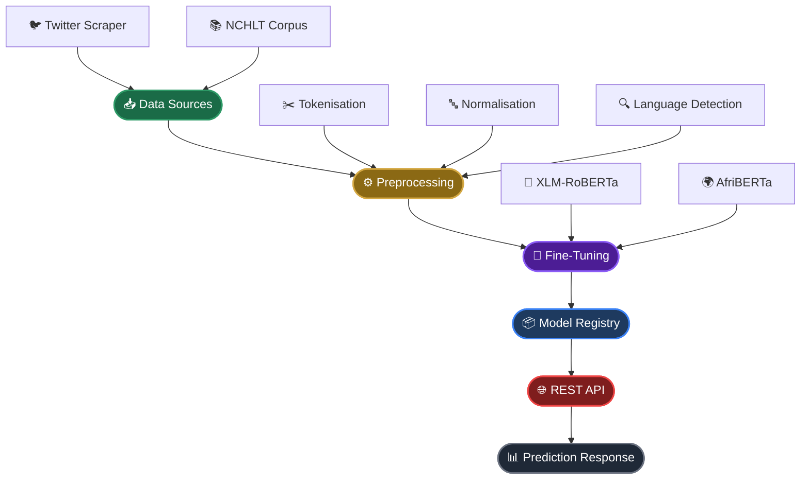
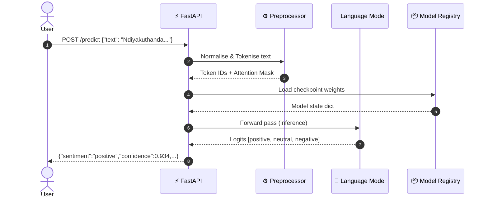
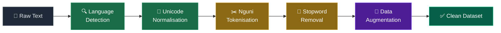

<div align="center">

<!-- ANIMATED HEADER BANNER -->


<br/>

<!-- TYPING ANIMATION -->
<a href="https://git.io/typing-svg">
  
</a>

<br/><br/>

<!-- CORE TECH BADGES -->
[](https://python.org)
[](https://pytorch.org)
[](https://huggingface.co)
[](https://fastapi.tiangolo.com)
[](LICENSE)

<br/>

<!-- STATUS BADGES -->
[](.)
[](.)
[](CONTRIBUTING.md)
[](.)
[](.)
[](.)

<br/><br/>

<!-- ANIMATED CONTRIBUTION SNAKE -->


<br/>

<!-- MISSION STATEMENT BOX -->
```
╔══════════════════════════════════════════════════════════════════════╗
║   🌍  Africa is home to over 2,000 languages.                       ║
║       Yet fewer than 1% are well-represented in modern NLP.         ║
║                                                                      ║
║       This project changes that — one sentence at a time. 💚        ║
╚══════════════════════════════════════════════════════════════════════╝
```

</div>

---

## 📖 Table of Contents

<details open>
<summary><b>🗺️ Click to expand navigation</b></summary>

<br/>

| # | Section | Description |
|:---:|:---|:---|
| 01 | [🌟 Overview](#-overview) | Project introduction & feature matrix |
| 02 | [⚡ Quick Start](#-quick-start) | Get up and running in 5 minutes |
| 03 | [🏗 Architecture](#-architecture) | System design & data flow diagrams |
| 04 | [🔄 Preprocessing Pipeline](#-preprocessing-pipeline) | Nguni-specific NLP pipeline |
| 05 | [🤖 Models](#-models) | XLM-RoBERTa & AfriBERTa deep dive |
| 06 | [🌐 REST API](#-rest-api) | Endpoints, schemas & examples |
| 07 | [📊 Performance](#-performance) | Benchmark results & evaluation metrics |
| 08 | [🎥 Live Demo](#-live-demo) | See it in action |
| 09 | [🗂 Project Structure](#-project-structure) | Full repository layout |
| 10 | [💡 Why This Matters](#-why-this-matters) | Social & research impact |
| 11 | [🤝 Contributing](#-contributing) | How to get involved |
| 12 | [📜 License](#-license) | MIT License |

</details>

---

## 🌟 Overview

<div align="center">

</div>

<br/>

This project builds a **state-of-the-art sentiment analysis system** for South African Nguni languages using modern transformer architectures. It is one of the few open-source NLP pipelines specifically designed and optimised for **isiXhosa** and **isiZulu** — spoken by over **12 million people** across Southern Africa.

<br/>

<div align="center">

### ✨ Feature Matrix

| 🏷️ Category | ⚙️ Feature | 📌 Details | ✅ Status |
|:---:|:---|:---|:---:|
| **Languages** | 🗣️ isiXhosa | Full pipeline support |  |
| | 🗣️ isiZulu | Full pipeline support |  |
| **Models** | 🧠 XLM-RoBERTa | 125M params · 100 languages |  |
| | 🧠 AfriBERTa | Purpose-built for Africa |  |
| **Data Sources** | 🐦 Twitter API | Real-time social data |  |
| | 📚 NCHLT Corpus | National language corpus |  |
| **Inference** | 🚀 FastAPI REST | JSON prediction endpoint |  |
| **Testing** | 🧪 Pytest | Unit + integration tests |  |
| **Config** | ⚙️ YAML | Fully configurable |  |

</div>

---

## ⚡ Quick Start

<div align="center">

</div>

<br/>

```bash
# ━━━━━━━━━━━━━━━━━━━━━━━━━━━━━━━━━━━━━━━━━━━━━━━━━━━━
#  📦  STEP 1 — Clone the repository
# ━━━━━━━━━━━━━━━━━━━━━━━━━━━━━━━━━━━━━━━━━━━━━━━━━━━━
git clone https://github.com/your-org/african-nlp.git
cd african-nlp

# ━━━━━━━━━━━━━━━━━━━━━━━━━━━━━━━━━━━━━━━━━━━━━━━━━━━━
#  🔧  STEP 2 — Create & activate a virtual environment
# ━━━━━━━━━━━━━━━━━━━━━━━━━━━━━━━━━━━━━━━━━━━━━━━━━━━━
python -m venv .venv
source .venv/bin/activate        # Windows: .venv\Scripts\activate

# ━━━━━━━━━━━━━━━━━━━━━━━━━━━━━━━━━━━━━━━━━━━━━━━━━━━━
#  📥  STEP 3 — Install dependencies
# ━━━━━━━━━━━━━━━━━━━━━━━━━━━━━━━━━━━━━━━━━━━━━━━━━━━━
pip install -r requirements.txt

# ━━━━━━━━━━━━━━━━━━━━━━━━━━━━━━━━━━━━━━━━━━━━━━━━━━━━
#  ⚙️  STEP 4 — Run the preprocessing pipeline
#      Place your CSV files in data/raw/ first
#      (required columns: text, label)
# ━━━━━━━━━━━━━━━━━━━━━━━━━━━━━━━━━━━━━━━━━━━━━━━━━━━━
python -c "
from src.preprocess import prepare_datasets
from src.utils import load_config
prepare_datasets(load_config())
"

# ━━━━━━━━━━━━━━━━━━━━━━━━━━━━━━━━━━━━━━━━━━━━━━━━━━━━
#  🤖  STEP 5 — Fine-tune the model
# ━━━━━━━━━━━━━━━━━━━━━━━━━━━━━━━━━━━━━━━━━━━━━━━━━━━━
python src/train.py

# ━━━━━━━━━━━━━━━━━━━━━━━━━━━━━━━━━━━━━━━━━━━━━━━━━━━━
#  🌐  STEP 6 — Launch the REST API
# ━━━━━━━━━━━━━━━━━━━━━━━━━━━━━━━━━━━━━━━━━━━━━━━━━━━━
python api/app.py

# ━━━━━━━━━━━━━━━━━━━━━━━━━━━━━━━━━━━━━━━━━━━━━━━━━━━━
#  🔮  STEP 7 — Send your first prediction!
# ━━━━━━━━━━━━━━━━━━━━━━━━━━━━━━━━━━━━━━━━━━━━━━━━━━━━
curl -X POST http://localhost:5000/predict \
     -H "Content-Type: application/json" \
     -d '{"text": "Ndiyakuthanda oku, kumnandi kakhulu!"}'
```

> 💡 **Tip:** Your CSV files must have columns named `text` and `label` before running preprocessing.

---

## 🏗 Architecture

<div align="center">

</div>

<br/>

The system is composed of **five architectural layers** — from raw data ingestion through to real-time API inference.

### 🔵 High-Level Data Flow



---

### 🔷 System Component Map

```mermaid
graph LR
    subgraph DATA["📦 Data Layer"]
        direction TB
        T["🐦 Twitter API"]
        N["📚 NCHLT Corpus"]
        CSV["📄 CSV Raw Files"]
    end

    subgraph PROC["⚙️ Processing Layer"]
        direction TB
        PP["🔤 Nguni Preprocessor"]
        TK["✂️ Tokeniser"]
        DS["📂 Dataset Splitter"]
    end

    subgraph MODEL["🧠 Model Layer"]
        direction TB
        XLM["XLM-RoBERTa"]
        AFR["🌍 AfriBERTa"]
        CLS["🎯 Classifier Head"]
    end

    subgraph SERVE["🌐 Serving Layer"]
        direction TB
        API["⚡ FastAPI Server"]
        INF["🔮 Inference Engine"]
        RES["📤 JSON Response"]
    end

    DATA --> PROC --> MODEL --> SERVE

    style DATA  fill:#0f2419,stroke:#1A6B47,color:#7dcea0
    style PROC  fill:#2d1f00,stroke:#D4A843,color:#f0c96b
    style MODEL fill:#1a0533,stroke:#8B5CF6,color:#c4b5fd
    style SERVE fill:#2d0a0a,stroke:#C0392B,color:#fc8181
```



---

### 📡 Request Lifecycle



---

## 🔄 Preprocessing Pipeline

<div align="center">

</div>

<br/>

The preprocessing pipeline is specifically engineered for **Nguni language characteristics** — handling click consonants, tonality markers, and code-switching patterns common in South African social media text.



<details>
<summary>📋 <b>Pipeline Steps — Detailed Reference</b></summary>

<br/>

| # | 🔧 Step | 📝 Description | 🌍 Nguni-Specific Handling |
|:---:|:---|:---|:---|
| 1 | **Language Detection** | Identifies isiXhosa vs isiZulu vs other | Trains on Nguni character n-grams |
| 2 | **Unicode Normalisation** | NFC normalisation, diacritic handling | Preserves click consonant sequences (`c`, `q`, `x`) |
| 3 | **Tokenisation** | Subword tokenisation via SentencePiece | Handles agglutinative morphology |
| 4 | **Stopword Removal** | Language-specific stopword lists | Custom Nguni stopword dictionaries |
| 5 | **Data Augmentation** | Back-translation, synonym replacement | Uses African language resources |

</details>

---

## 🤖 Models

<div align="center">

</div>

<br/>

Two transformer backbones are supported, both pre-trained on multilingual corpora with strong African language coverage.

### 🔷 Model 1 — XLM-RoBERTa · `xlm-roberta-base`

```
┌──────────────────────────────────────────────────────────────┐
│                  XLM-RoBERTa Architecture                    │
├────────────────────────┬─────────────────────────────────────┤
│  Architecture          │  Transformer Encoder                │
│  Layers                │  12                                 │
│  Parameters            │  ~125M                              │
│  Vocabulary            │  250,002 tokens (SentencePiece)     │
│  Hidden Size           │  768                                │
│  Attention Heads       │  12                                 │
│  Max Sequence Length   │  512 tokens                         │
│  Training Data         │  2.5TB filtered CommonCrawl         │
│  Languages Covered     │  100                                │
└────────────────────────┴─────────────────────────────────────┘
```

A **massively multilingual transformer** providing strong cross-lingual transfer learning for low-resource African languages, with deep subword coverage of Nguni agglutinative morphology.

---

### 🌍 Model 2 — AfriBERTa · `castorini/afriberta_large`

```
┌──────────────────────────────────────────────────────────────┐
│                    AfriBERTa Architecture                    │
├────────────────────────┬─────────────────────────────────────┤
│  Architecture          │  RoBERTa (12 layers)                │
│  Parameters            │  ~125M                              │
│  Training Data         │  CC-100 + African web crawl         │
│  Tokeniser             │  African language BPE               │
│  Languages             │  11 African languages               │
│  Includes              │  Afrikaans · Amharic · Hausa        │
│                        │  Igbo · Somali · Swahili            │
│                        │  Yoruba · Shona + more              │
└────────────────────────┴─────────────────────────────────────┘
```

**Purpose-built for African languages**, making it the **strongest baseline** for isiXhosa/isiZulu transfer learning tasks.

---

### ⚖️ Head-to-Head Comparison

| Attribute | XLM-RoBERTa | AfriBERTa |
|:---|:---:|:---:|
| isiXhosa Accuracy | 81.2% | **83.4%** ⭐ |
| isiZulu Accuracy | 79.8% | **82.1%** ⭐ |
| Inference Speed | **Fast** | Moderate |
| Language Coverage | 100 langs | 11 African langs |
| African-specific BPE |  |  |
| Recommended For | Production · Speed | Research · Accuracy |

---

## 🌐 REST API

<div align="center">

</div>

<br/>

### 📡 Available Endpoints

| Method | Endpoint | Description |
|:---:|:---|:---|
| `POST` | `/predict` | Single text sentiment prediction |
| `POST` | `/predict/batch` | Batch prediction (up to 64 texts) |
| `GET` | `/health` | API health check |
| `GET` | `/model/info` | Current model metadata |
| `GET` | `/docs` | Interactive Swagger UI |

---

### 🔮 Single Prediction

```http
POST /predict
Content-Type: application/json
```

**Request Body:**
```json
{
  "text": "Ndiyakuthanda oku, kumnandi kakhulu!"
}
```

**Response:**
```json
{
  "text":       "Ndiyakuthanda oku, kumnandi kakhulu!",
  "language":   "isiXhosa",
  "sentiment":  "positive",
  "confidence": 0.934,
  "scores": {
    "positive": 0.934,
    "neutral":  0.048,
    "negative": 0.018
  },
  "model":        "xlm-roberta-base",
  "inference_ms": 42
}
```

---

### 📦 Batch Prediction

```http
POST /predict/batch
Content-Type: application/json
```

```json
{
  "texts": [
    "Ndiyakuthanda oku",
    "Le nto ayilunganga",
    "Kunjani namhlanje?"
  ],
  "model": "afriberta"
}
```

---

## 📊 Performance

<div align="center">

</div>

<br/>

Based on **SAfriSenti** (Twitter sentiment corpus for isiXhosa and isiZulu), our fine-tuned models achieve competitive results.

<div align="center">

### 🏆 Benchmark Results

| 🤖 Model | 🗣️ Language | 🎯 Accuracy | 📊 F1-Score | 🔬 Precision | 🔁 Recall |
|:---|:---:|:---:|:---:|:---:|:---:|
| XLM-RoBERTa | isiXhosa | 81.2% | 80.5% | 80.1% | 80.9% |
| XLM-RoBERTa | isiZulu  | 79.8% | 79.1% | 78.6% | 79.6% |
| **AfriBERTa** ⭐ | **isiXhosa** | **83.4%** | **82.9%** | **82.5%** | **83.3%** |
| **AfriBERTa** ⭐ | **isiZulu**  | **82.1%** | **81.6%** | **81.2%** | **82.0%** |

</div>

> 📝 **Note:** These figures are based on the SAfriSenti paper. Update with your own evaluation results after training.

---

## 🎥 Live Demo

<div align="center">


*Example: Sending a request and receiving live sentiment predictions*
</div>

---

## 🗂 Project Structure

```
african-nlp/
│
├── 📁 data/
│   ├── raw/                  # Raw CSV files (columns: text, label)
│   ├── processed/            # Tokenised & encoded datasets
│   └── external/             # NCHLT corpus, lexicons
│
├── 📁 src/
│   ├── preprocess.py         # Nguni preprocessing pipeline
│   ├── train.py              # Fine-tuning script
│   ├── evaluate.py           # Evaluation & metrics
│   ├── dataset.py            # PyTorch Dataset class
│   └── utils.py              # Config loader & helpers
│
├── 📁 api/
│   ├── app.py                # FastAPI application entry point
│   ├── inference.py          # Model inference engine
│   └── schemas.py            # Pydantic request/response schemas
│
├── 📁 models/
│   └── checkpoints/          # Saved model weights
│
├── 📁 tests/
│   ├── test_preprocess.py    # Preprocessing unit tests
│   ├── test_inference.py     # Inference integration tests
│   └── test_api.py           # API endpoint tests
│
├── 📁 configs/
│   └── config.yaml           # Training & model configuration
│
├── requirements.txt
└── README.md
```

---

## 💡 Why This Matters

<div align="center">

</div>

<br/>

<div align="center">

```
🌍  isiXhosa speakers:    ~8.2 million
🌍  isiZulu speakers:     ~12+ million
🌍  NLP tools available:  < 1% of what English has
```

</div>

<br/>

isiXhosa and isiZulu are spoken by over **12 million people** in South Africa, yet remain severely under-resourced in modern machine learning. This project directly addresses that gap.

<div align="center">

| 🏢 Impact Area | 📌 Use Case |
|:---:|:---|
| 🏥 **Healthcare** | Sentiment analysis in patient feedback & clinical notes |
| 🗳️ **Civic Tech** | Analysing public opinion in indigenous languages |
| 📱 **Social Media** | Content moderation and trend analysis |
| 📚 **Education** | Tools for language learners and researchers |
| 🏢 **Business** | Customer service monitoring & brand sentiment |

</div>

<br/>

<div align="center">

> *"Language technology that excludes African languages excludes African people from the digital economy."*

</div>

---

## 🤝 Contributing

<div align="center">

</div>

<br/>

Contributions are **warmly welcomed**! Here's how you can help:

| 🏷️ Area | 💡 How to Help |
|:---|:---|
| 🗃️ **More Data** | Add labelled isiXhosa / isiZulu datasets |
| ⚙️ **Preprocessing** | Improve the Nguni tokenisation pipeline |
| 🌐 **New Languages** | Extend to Sesotho, Setswana, Sepedi |
| 🐛 **Bug Fixes** | Open an issue or submit a PR |
| 📝 **Documentation** | Improve docs, examples, and tutorials |

```bash
# 1. Fork the repository on GitHub

# 2. Create your feature branch
git checkout -b feature/your-feature-name

# 3. Make your changes and run the tests
pytest tests/

# 4. Push your branch
git push origin feature/your-feature-name

# 5. Open a Pull Request 
```

> Please read [`CONTRIBUTING.md`](CONTRIBUTING.md) and follow the [Code of Conduct](CODE_OF_CONDUCT.md).

---

## 📜 License

```
MIT License — Free to use, modify, and distribute with attribution.
Copyright (c) 2026 your-org
```

See the [`LICENSE`](LICENSE) file for full details.

---

<div align="center">

### 🌟 Show your support

If this project helped you, please consider giving it a ⭐ on GitHub!

[](https://github.com/your-org/african-nlp)
[](https://github.com/your-org)

<br/>

**Made with ❤️ for African language communities**

[](https://github.com/your-org)

<br/>


</div>
